# Experimental Results

This document summarizes the main experimental results and my observations.

Training conditions of experiments are indicated below

---

## 1. DINO Representation Evaluation

| Dataset | Random Chance | k-NN Probe | Linear Probe | Fine Tune | Random Init |
| ----- | ----- | ----- | ----- | ----- | ----- |
| Mini ImageNet | 1.0% | 19.2% | 24.0% | 43.5% | 36.9% |
| STL-10 | 10.0% | 45.2% | 47.7% | 60.0% | 51.8% |

### Interpretation

- DINO pretrained features can be fed as good input to simple kNN classifier.
- Considering that the random shot accuracy of Mini ImageNet is 1%, DINO-pretrained frozen features achieve substantially higher accuracy than random chance with both k-NN and linear probing.
- The improvement after fine-tuning on Mini-ImageNet suggests that DINO pretraining learns well generalized features that can be easily fine-tuned in transfer learning of unseen images.
- On STL-10, frozen DINO self-supervised backbone features adopted to straightforward k-NN and linear probing achieves comparable performance to fully supervised finetuned features(45.2%, 47.7% vs 51.8%).

---

## 2. Attention Map Evolving Visualization

Segmentation masks are obtained by thresholding the self-attention map of most well-segmented head of each image to keep 60% of the mass. 

Each test image index is 1154, 2143, 2767 respectively and each column represents epoch of pretraining in order of 1, 10, 20, 30

  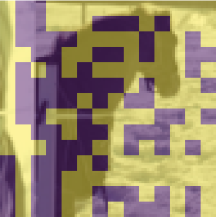
  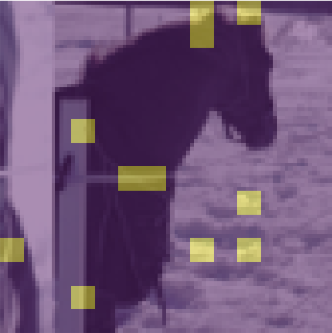
  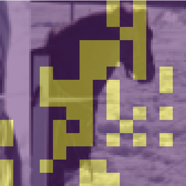
  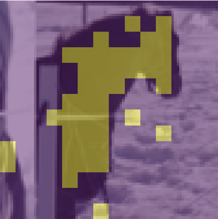

  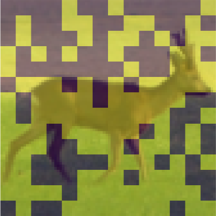
  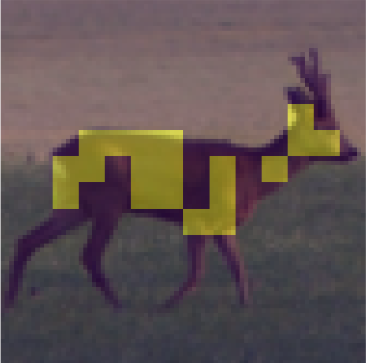
  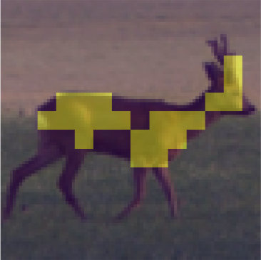
  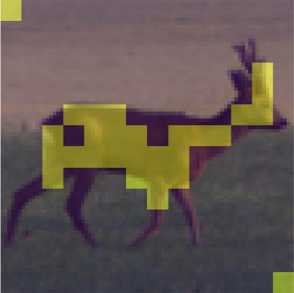

  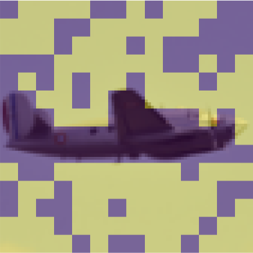
  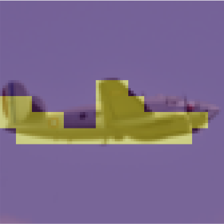
  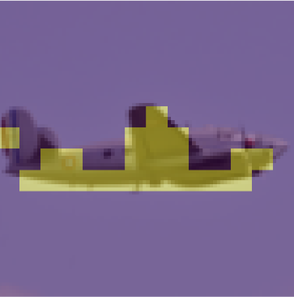
  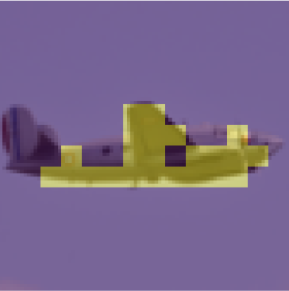

### Observation

- Masks that were evenly distributed in the first epoch start to concentrate on the objects as the epochs increase.
- In respect to the last row, the masks are on the parts except the airplane in the first epoch, and on the airplane in the other epochs.

### Interpretation

- In the first epoch, most patches were attended uniformly, so there are a lot of patches, but as training goes on, the number of patches decreases and they gather on the objects.
- The learned CLS attention increasingly concentrates on semantically relevant object regions.

---

## 3. Multi-Crop Ablation

| Multi-Crop | k-NN Probe |
| ----- | ------------: |
| Enabled |        45.2% |
| Disabled |        44.4% |

### Interpretation

- Multi-crop encourages model to learn 'local to global' correspondences and it leads to retain slightly more generalized visual features.

---

### Training conditions

**Pretraining**

Conditions of linear head and fine tune are same with pretraining if not mentioned.

| Conditions | Pretraining |
|---|---|
| Dataset | STL-10 (Unlabeled) |
| Model | DINO-Style ViT |
| Optimizer | AdamW |
| Learning rate scheduler | Linear warmup + Cosine annealing |
| Learning rate | Linear warmup to 0.0005(1-3 epoch), then cosine annealing to 0.00001(4-30 epoch) |
| View of teacher and student | teachers: 2 global crops / students: 2 local crops |
| Teacher temperature | 0.04 |
| Student temperature | 0.1 |
| Teacher momentum | 0.996 |
| Centering momentum | 0.9 |
| Output dimensionality K | 150 |
| Batch size | 192 |
| Epochs | 30 |
| Data augmentation | RandomResized crop, Horizontal flip, Color jitter|
| Weight decay | 0.001 |
| Device | cuda |

**Linear Head**

| Conditions | Linear Head |
|---|---|
| Dataset | STL-10 (Train, Test) / Mini ImageNet |
| Learning rate scheduler | Linear warmup + Cosine annealing |
| Learning rate | Linear warmup to 0.0005(1-4 epoch), then cosine annealing to 0.00001(5-40 epoch) |
| Data augmentation | Resize |
| Weight decay | 0 |

**Fine Tuning**

| Conditions | Fine Tuning |
|---|---|
| Dataset | STL-10 (Trian, Test) / Mini ImageNet |
| Learning rate scheduler | Linear warmup + Cosine annealing |
| Learning rate | Linear warmup to 0.0005(1-4 epoch), then cosine annealing to 0.00001(5-40 epoch) |
